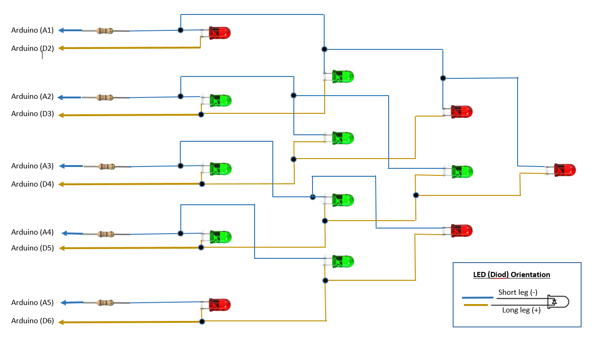
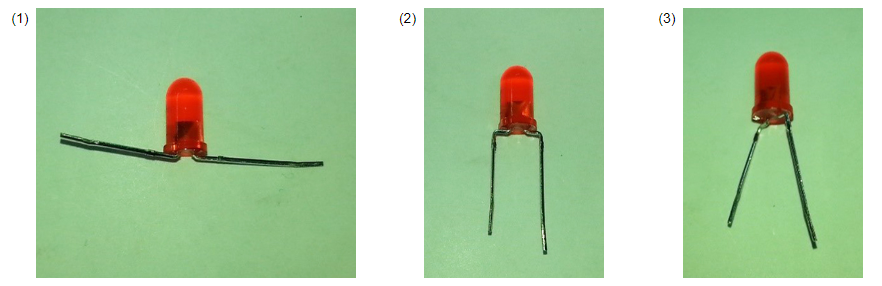
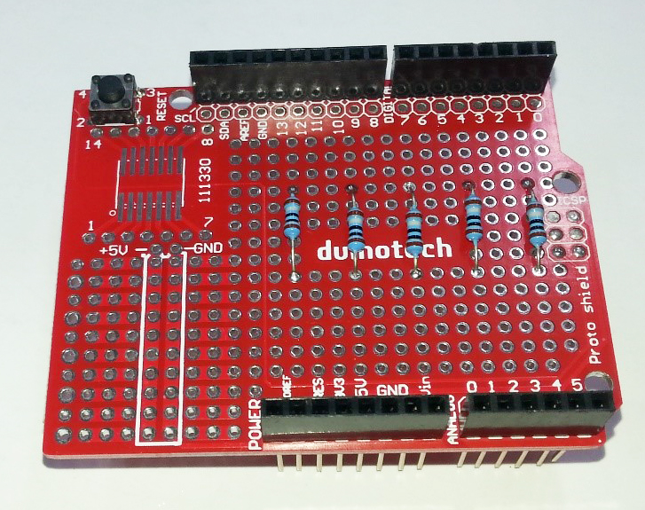
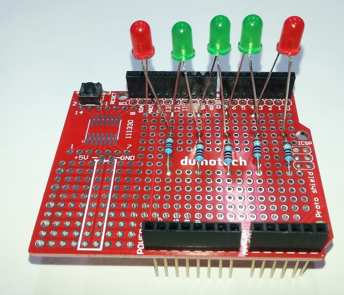
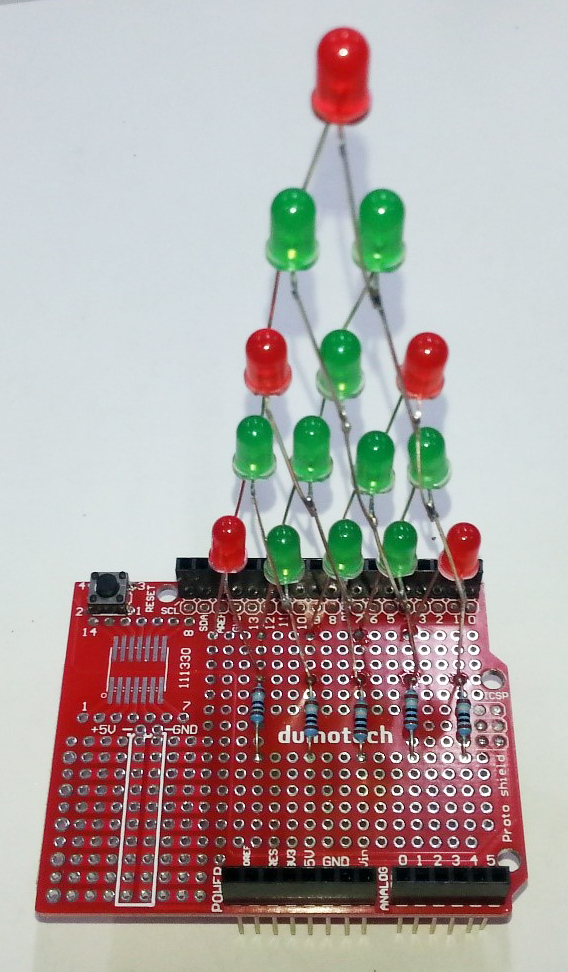
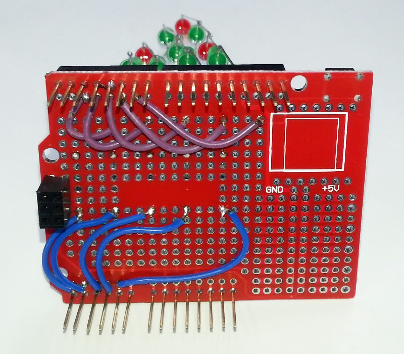

# LED basic christmas tree
_Project 00009_

Here's a good project for a beginner, which can add a bit of Christmas spirit to your workbench, and also teach
you how multiple LED's can be controlled from a handful of microcontroller pins. Being Arduino based, the LED
Christmas Tree can also be customized to your liking. There is some soldering required for this project, so make
sure you have an adult's assistance when building the tree. A set of needle-nose pliers will also come in handy.

## Bill of Materials
| Qty | Code | Description |
| --- | --- | ---|
|1 | [XC4410](http://jaycar.com.au/p/XC4410) | UNO main board
|1 | [XC4482](http://jaycar.com.au/p/XC4482) | prototyping shield
|1 | [RR0554](http://jaycar.com.au/p/RR0554) | pack of 8, 180 ohm resistors
|5 | [ZD0150](http://jaycar.com.au/p/ZD0150) | 5mm red LED
|10 | [ZD0170](http://jaycar.com.au/p/ZD0170) | 5mm green LED

## Connection Diagram

## Downloads
* [Source code](../downloads/LED_christmas_tree.zip)

## Software Libraries
|Library | Author
| --- |--- |


## Assembly

The construction of the tree of LED's might look a bit tricky, but if you following the steps carefully, you should
have no trouble. We'll start by carefully bending the legs of the LED's. The legs don't like being bent and
straightened and bent again, in case they break off.

Start by bending the legs 90 degrees so that they point straight out the sides (1), then about 3mm further along
the legs, bend the legs straight down (2). We want to make sure that the legs run outside the main body of the
LED. Finally, bend the left leg towards you be about 10 degrees and bend the right leg back by 10 degrees. The
result should be like (3).



You'll notice that one leg is longer than the other. This is normal, and is used to differentiate the cathode (negative terminal, and it also has a flat on the body of the LED near it) from the anode (or positive terminal). We'll need to know this later so our LED's go onto the board the correct way.

The next step is to fit the resistors to the prototyping board- we'll do this because they'll sit lower than the LED's, and they'll be hard to get to if the LED's went in first.



otice that one end of the resistors is at the fourth row of holes in line with the large hole at the end of the prototyping board, and they are spaced three holes apart in line with D1, D4, D7, between D9 and D10, and between D12 and D13. The other end of the resistor is in the sixth row of holes away from the analog pins.



Then we mount the LED's. The short leg of the LED gets mounted on the end of the resistor leg- this gives it a bit more height. Then the other leg of the LED gets soldered to a hole on the protoboard three holes over, and three holes across. For most of the LED's, this means their anode (the long leg) is actually in line with the next resistor over. This should give us the legs of the LED's running clear of either side of the bodies. Note the colours too- we've done a red LED at the end and three green LED's in the middle. Keep following the pattern from the above photo as we build up.

Solder the negative lead of the next row of LED's to the negative lead of the previous row (we do this first because it's shorter). Then solder the positive lead of the LED to the positive LED of the adjacent LED below. If you need to, you can now adjust the negative lead.

As we keep building up, note that all the negative leads are on the side with the resistors, and all of them slope to the right at roughly the same angle, and all the positive leads are on the other side, sloping the other way. Complete the rows of three, two and one LED's in a similar fashion, and check against the picture below.



The final wiring step is to connect the LED matrix we have built back to the pins that go to the Uno board. In order, the positive leads go to D2, D3, D4, D5 and D6, while the resistors go to A1, A2, A3, A4 and A5.



## Programming
Download the source code and extract into a new folder, open the .ino file in the Arduino IDE and press upload.

LED's are rapidly switched on and off in turn- even though it looks like it they might be all on. The rest of the program in the loop function cycles through a series of patterns, which are set by the values in the tree[] array. You can try changing some of these numbers to see how the pattern changes.

There aren't any special libraries to load or install, it's simply a case of opening the sketch, selecting the board and serial port, and pressing upload. The tree should spring to life, with the lights forming a pattern. If one LED doesn't seem to be lighting, it might be the wrong way around. If it's a whole diagonal row that's not working, then the wiring for that row might be broken, or might not be going to the correct pin.

## Use

As mentioned above, you can change the pattern by changing values in the tree[] array. You might want to add a sensor, and have the tree change patterns if a change is detected in the sensor.

If you're interested in how the multiplexing works, you can change the following line in the treesetup() function to slow down the scanning. Change:

```c
TCCR1B = _BV(WGM12) | _BV(CS10);
```
to
```c
TCCR1B = _BV(WGM12) | _BV(CS10) | _BV(CS12);
```
This might be clearer to see if you change all the values in the tree[] array to 32767 (so that all the LED's are activated).

If you aren't familiar with binary numbers, you might have worked out how the sketch knows which LED to light up. If not, the diagram below shows the values associated with each LED- to generate a pattern, add up the numbers from the diagram where you want the LED lit. You should see that if you add up all the numbers, you get 32767 as we noted above.
```
            16384                   top row
        4096    8192
      512   1024  2048
    32    64    128   256
  1     2    4      8     16         bottom row
 ```
## Future Improvements
